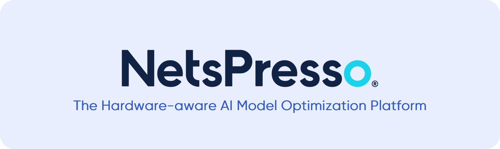
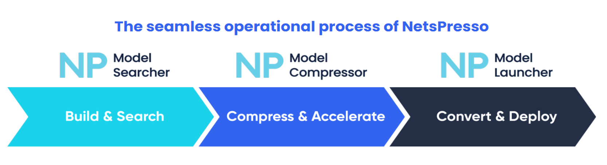
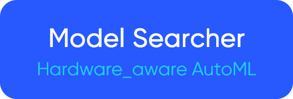
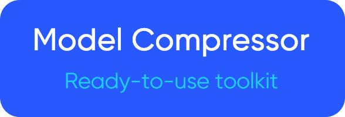

  

    
  

 

  

    
    
    <a href="https://pytorch.org/">= 1.10.x.-EE4C2C?style=flat&logo=pytorch&logoColor=#EE4C2C"/></a>
     
    
    
  

   

  <a href="https://netspresso.ai/">NetsPresso</a> is a hardware-aware AI model optimization platform. NetsPresso resolves AI-related constraints in business use cases and enables cost-efficiency and enhanced performance by removing the requirement for high-spec servers and network connectivity and preventing high latency and personal data breaches.

  Easily compress various models with our resources here. Please browse the NetsPresso <a href="https://docs.netspresso.ai/docs">Docs</a> for details, and join our <a href="https://github.com/orgs/Nota-NetsPresso/discussions">Discussion Forum</a> for providing feedback or sharing your use cases.

  

    
    
    
    
    
    
    
    
    
  

 

## 
NetsPresso Workflow

 

 
 

  
  
  
  
  

 

<table width="90%" align="center">
  <tr>
    <td width="33.3%" align="center">Model Searcher</td>
    <td width="33.3%" align="center">Model Compressor</td>
    <td width="33.3%" align="center">Model Launcher</td>
  </tr>
  <tr>
    <td width="33.3%" align="center"><a href="https://docs.netspresso.ai/docs/model-searcher">Model Searcher</a> automatically searches optimized models for your target device AutoML</td>
    <td width="33.3%" align="center"><a href="https://docs.netspresso.ai/docs/model-compressor">Model Compressor</a> compresses models for better computational efficiency</td>
    <td width="33.3%" align="center"><a href="https://docs.netspresso.ai/docs/model-launcher">Model Launcher</a> accelerated models, simplified deployment</td>
  </tr>
</table>

## 
NetsPresso Compatible Models Zoo

Do you want to try compressing the SOTA model through NetsPresso without any modifications? If so, you can easily experience it through our NetsPresso compatible repo RIGHT NOW!

  
Image Classification

  
- [PyTorch-CIFAR-Models_Nota](https://github.com/Nota-NetsPresso/pytorch-cifar-models_nota)
  

  
Object Detection

  
- [YOLOv5_Nota](https://github.com/Nota-NetsPresso/yolov5_nota)
  

  
Semantic Segmentation

  
- [PIDNet_Nota](https://github.com/Nota-NetsPresso/PIDNet_nota)
  

## 
NetsPresso Model Compressor Best Practice

If you want to experience Model Compressor online without any installation, please refer to the [NetsPresso-Model-Compressor-ModelZoo](https://github.com/Nota-NetsPresso/NetsPresso-Model-Compressor-ModelZoo) repo that runs on Google Colab.

## 
Contact

Join our <a href="https://github.com/orgs/Nota-NetsPresso/discussions">Discussion Forum</a> for providing feedback or sharing your use cases, and if you want to talk more with Nota, please contact us <a href="https://www.nota.ai/contact-us">here</a>. 
Or you can also do it via email(contact@nota.ai) or phone(+82 2-555-8659)!

 

  
  
  
  
  
  
  
  
  

